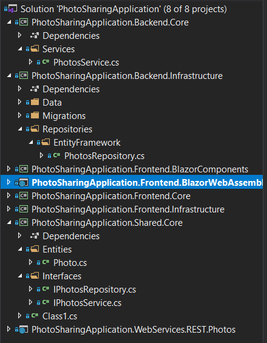

# Lab 5: REST backend

Build a backend using ASP.NET Core. Follow the same [Clean-ish Architecture](https://blog.cleancoder.com/uncle-bob/2012/08/13/the-clean-architecture.html) seen in an earlier lab:

* An `Backend.Infrastructure` class library project that knows how to actually read/persist data with repositories. We're going to use Entity Framework Core to talk to a SQL Server database
* A `Backend.Core` class library project that contains business logic that do some sort of validation before passing it on to the infrastructure

  Normally, this project would contain entities and interfaces as well, but they are identical to the ones we've used in the frontend. Therefore, we will be refactoring these into a `Shared` class library project
* The backend web application itself exposing the REST endpoints for retrieving, editing and deleting photos

Don't worry about connecting the frontend to the backend yet, we'll take care of that in the next lab.
