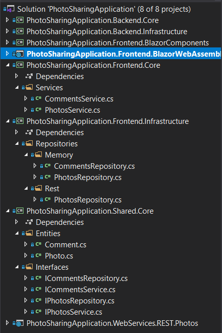

# Lab 7: setup comments



Now that photos are all set, we're gonna add functionality for people to leave comments.

Apply the same Clean-ish principles as with the photos:

* Define a `Comment` entity
	```cs
	public class Comment
	{
		public int Id { get; set; }
		public string UserName { get; set; }
		public string Subject { get; set; }
		public string Body { get; set; }
		public DateTime SubmittedOn { get; set; }

		public int PhotoId { get; set; }
		public Photo Photo { get; set; }
	}
	```
* Use a `CommentsService` for business logic
* Create a repository that works with a hard-coded list of comments. In a later lab, we'll add another comments repository that talks to the backend through gRPC. In may also be useful to temporarily switch back to the hard-coded list of photos for this lab.

As for the Blazor bits, create reusable components in the components class library project:
* `CommentComponent` that defines a parameter `ViewMode` to switch between the different CRUD operations
	* `CommentCreateComponent`
	* `CommentReadComponent`
	* `CommentEditComponent`
	* `CommentDeleteComponent`
* `CommentsComponent` to display all components using `CommentComponent` and to offer an option to add a comment by again using the `CommentComponent`. Usage might look something like this:

	```html
	<CommentComponent CommentItem="comment"
					ViewMode="CommentComponent.ViewModes.Read"
					OnUpdate="UpdateComment"
					OnDelete="DeleteComment" />
	```