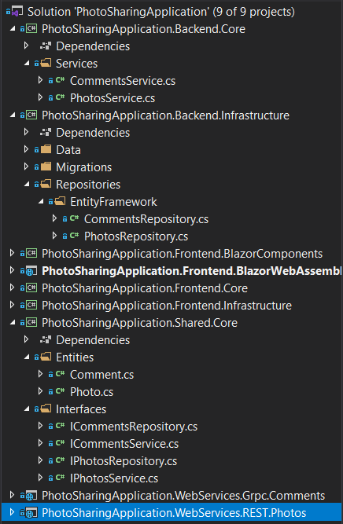

# Lab 8: gRPC backend

Add a new ASP.NET Core project that exposes a gRPC endpoint for retrieving, adding, updating and deleting comments with a photo. Remember that we'll be calling this service from another domain in the browser, so enable gRPC-Web and CORS for the endpoint.

The NuGet packages you'll need:
* `Grpc.Tools`
* `Google.Protobuf`
* `Grpc.AspNetCore`
* `Grpc.AspNetCore.Web`

After that, use the same [Clean-ish Architecture](https://blog.cleancoder.com/uncle-bob/2012/08/13/the-clean-architecture.html) as used for the REST endpoints:
* Add the entity and contracts to `Shared`
* Add a service in `Backend.Core` that will hold some validation in the future
* Add a repository in `Backend.Infrastructure` for persisting comments using Entity Framework Core
